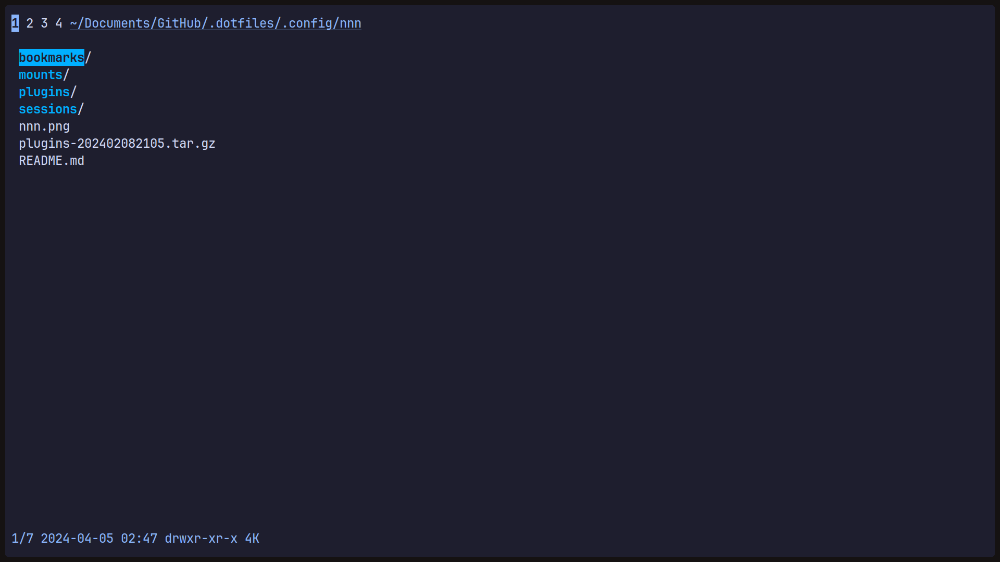

# nnn

## Description
[nnn](https://github.com/jarun/nnn) is a terminal based file manager.

## Plugins

    
Plugins Installed

### Plugins
- nmount [dependencies](plugins/nmount)
- mtpmount [dependencies](plugins/mtpmount)
- autojump [dependencies](plugins/autojump)
- dragdrop [dependencies](plugins/dragdrop)
- xdgdefault [dependencies](plugins/xdgdefault)
- preview-tabbed [dependencies](plugins/preview-tabbed)
- fzopen [dependencies](plugins/fzopen)

