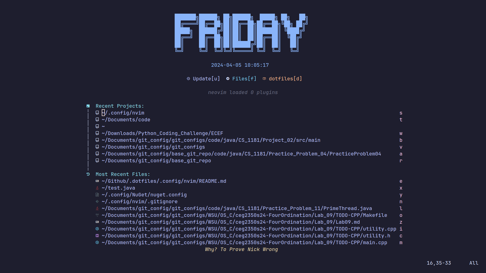

# NeoVim

## Dependencies

- [neovim](https://wiki.archlinux.org/title/Neovim)

## Why?

Neovim is a lighter and faster alternative to other IDEs. This setup aims at creating an IDE that is easily customizable, out of the box, and simple to use.

## Mason

[Mason](https://github.com/williamboman/mason.nvim) is a package manager for Neovim. Using the [Masontools](https://github.com/WhoIsSethDaniel/mason-tool-installer.nvim) we can auto
install certain languages, linters, and debuggers.

    
Auto Installed Packages

### Packages
- vim-language-server
- shellcheck 
- beautysh 
- lua-language-server
- stylua 
- luacheck 
- clang-format 
- clangd 
- codelldb 
- checkstyle 
- jdtls

## Java-Setup

If you are wanting to debug and test java with dap-ui, you will
need to run [JdtlsSetup](https://github.com/Sheepheerd/.dotfiles/tree/main/Scripts)
