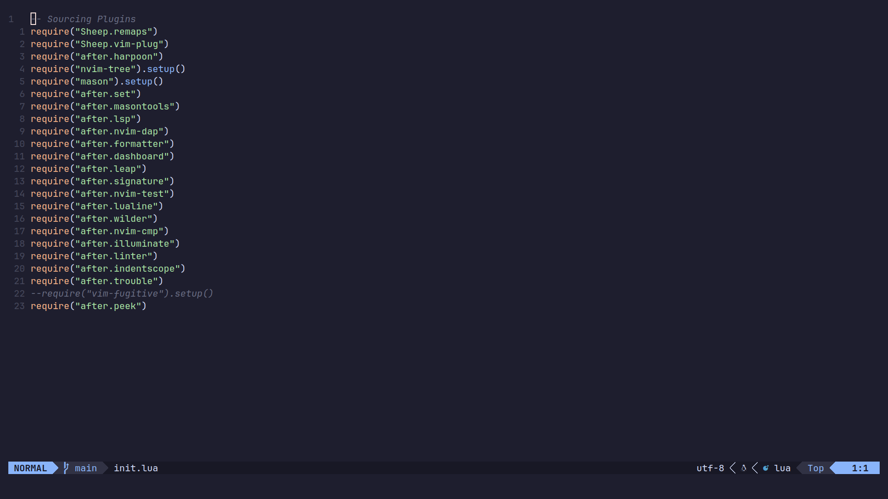

# NeoVim

## Dependencies

- [neovim](https://wiki.archlinux.org/title/Neovim)
- [neovim-older-but-new](https://github.com/neovim/neovim-releases)

## Why?

Jacob is goober

## How To Install

Place the `nvim` folder in the `~/.config` dir

## Mason

[Mason](https://github.com/williamboman/mason.nvim) is a package manager for Neovim. Using the [Masontools](https://github.com/WhoIsSethDaniel/mason-tool-installer.nvim) we can auto
install certain languages, linters, and debuggers.

    
Auto Installed Packages

### Packages

- lua-language-server
- stylua
- luacheck

